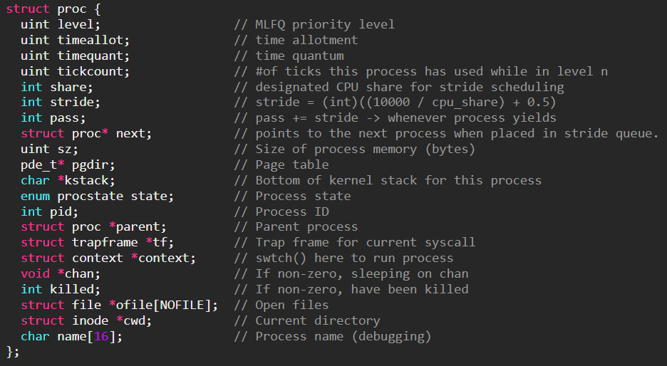
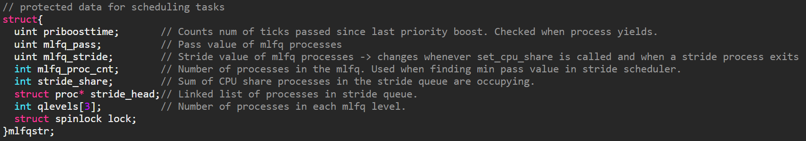
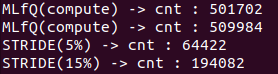
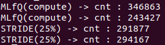

# Introduction
The existing xv6 scheduler loops through the process table containing maximum 64 processes and selects from them sequentially. We would like to apply the MLFQ and stride algorithm to our scheduler to acheive two goals.
1. Run interactive processes with higher priority than CPU intensive processes. -> Achieve balance of response time and turnaround time by learning from the process's behavior.

2. Allow user programs to request a specific amount of CPU share in a deterministic fashion.

# Design
Our scheduler will place all processes in the MLFQ when it is first created with fork() and only direct them to the stride queue when it explicitly calls the set_cpu_share() system call. Once a process is placed in the stride queue, it will stay there until it calls exit() and all of its resources has been reaped by the parent process.

When there are no processes in the stride queue, the processes will run using only the MLFQ algorithm. Our MLFQ consists of 3 levels, with level2 having the highest priority and level0 having the lowest priority. Any newly created process will be placed in level2. The scheduler will only select processes from the highest level queue that is not empty. A process in level2 can use up to 1 tick (10ms) of CPU time before being scheduled out.  Also, if it uses a total of 5 ticks while in level2, we will lower its priority to level1. The lowering of a priority makes sure that interactive jobs that don't use much of the CPU time maintain higher priority. The time quantum and time allotment values for each priority level is descripted as below. Also, to make sure processes in lower level queues are also given some CPU time, we boost all processes priority to level2 every 100 ticks (about 1 second).

| level | time quantum | time allotment | 
| ------ | ------ | ------- |
| 2 | 1 tick | 5 ticks |
| 1 | 2 ticks | 10ticks |
| 0 | 4 ticks | None |

When there is a process in the stride queue, we will allocate a CPU share to each process, calculate each of their strides, keep a track of their pass values, and make scheduling decisions based on those pass values. You should note that we keep one set of {share, stride, pass} values for all the processes in the MLFQ. Therefore the stride scheduler will have to compare the pass values of each process in the stride queue and the collective MLFQ pass value (sometimes there might be no process running in the MLFQ). If the collective MLFQ pass value is the smallest, the scheduler chooses from the processes in the MLFQ, using the same MLfQ algorithm from before. We can think that the processes inside the MLFQ, operate according to the MLFQ algorithm and are logically insulated from the stride scheduling process that happens on the larger scale.  

For implementing the MLFQ, instead of making 3 different physical ptables for the three different levels, we just keep an array called qlevels that keeps track of the number of processes in each queue. Each process will contain a level field in its proc structure to indicate which level it is in instead. Incrementing and decrementing the qlevels array value correctly is crucial, since the mlfq scheduler will reference the qlevels array in order to find out which level it has to choose from. 

Not only when a process exits, but also when it falls into sleep, or enters the stride queue, we must adjust the qlevels array. Likewise, we have to update the qlevels array when a process is newly created or when a process wakes up from sleeping (see mlfqrm() and mflqadd()). Important variables related to scheduling such as the qlevels array will be kept in a single C strcuture called mlfqstr (short for mlfq + stride). 

Time allotment checking, priority boosting, and time quantum checking will all be implemented in the yield function. Whenever a process yields, whether through a voluntary system call or a timer interrupt, we increment its tick count and proceed assuming it has used up its entire time quantum.

# Implementation
## New proc structure with additional fields
The new process control block contains information needed for mlfq and stride scheduling.  


- **level**   
  The mlfq level 0~2. If a process calls set_cpu_share successfully, level is set to -1 to indicate it is in the stride queue. 

- **timeallot, timequantum**   
  These two values are determined by the mlfq level. Its values are changed accordingly when a process's mlfq level changes (e.g. in priboost() or lowerlevel()). A process with level=-1 (in stride queue) will have a time quantum of 1 and this value does not change until the process exits. 

- **tickcount**  
  This value counts the number of ticks a mlfq process used while running in a MLFQ level. This value is set to 0 when a process is first set up in allocproc() and is incremented whenever it yields. This value is reset to 0 whenever its mlfq level is changed. 

- **share**  
  This values is set only when a process calls the set_cpu_share system call. We need to know how much of CPU share a process holds to make sure we make that amount of share free when that process exits (see striderm()). 

- **stride**  
  A larger stride indicates a process with small CPU share, and a smaller stride indicates a large CPU share. It is calcuated as **(int)((10000 / share) + 0.5)**. Adding 0.5 is to round up. 

- **pass**  
  A process's pass value is incremented by its stride value whenever a process yields(see yield()). When the stride queue is not empty, the scheduler selects the process with the smallest pass value. Pass values are initialized as 0 when a processes are first set up in allocproc().

- **next**  
  This is a pointer to a different proc strucuture. This is needed for implementing a linked list of stride processes (process that validly called set_cpu_share at least once). This list will be used in the scheduler to find the process with the smallest pass value. The linked list can be accessed through the stride_head poiter in the global mlfqstr structure. A process is added to the linked list if a call to set_cpu_share is successful, and deleted from the linked list when it exits. Keeping this list prevents having to loop through the entire process tables mutiple times when scheduling.
  
## Protected data for scheduling tasks
  
<!--There are many data related to the scheduling process that has to be maintained, and I collected them into a global data structure and made sure a race condition doesn't occur by protecting it with a lock. Time stamps that record when a priority boost has occured is used in the yield function to determine if it is time to perform another priority boost. Also, we manintain an array that stores how many processes are currently running in each mlfq level. We need this information to know which mlfq levels are empty, so we can choose the correct mlfq level to select from. We also maintain stride scheduling related data such as the stride and pass value of mlfq processes and a pointer to a linked list of processes in the stride queue. We also maintain a seperate field that stores the number of runnable processes currenlty in the mlfq. This is to avoid calculating qlevels[2] + qlevels[1] + qlevels[0] at every scheduler execution. Finally, stride_share that holds the sum of CPU share all the processes in the stride queue is used. -->

- **priboosttime**  
  In the yield function, we check the global tick variable to see if 100 ticks has passed since the last priority boost. For this, we keep a priboosttime variable to record the tick value at the time a priority boost occurs. If the current tick is 100 ticks larger than the priboosttime values, we call priboost(). See yield()

- **mlfq_pass**  
  Pass values for processes in the MLFQ are counted collectively in mlfq_pass. It is updated in in the yield() function whenever a MLFQ process yields. 

- **mlfq_stride**
  Whenever a process in the MLFQ yields, we increment mlfq_pass by mlfq_stride. mlfq_stride value is updated whenever there is a change in CPU share. CPU share change occurs when a process calls, set_cpu_share successfully(CPU share increase), or when a process holding some CPU share exits (CPU share decrease).

- **mlfq_proc_cnt**
  This value is the number of processes that are RUNNABLE in the MLFQ. It is calculated as qlevels[2] + qlevels[1] + qlevels[0]. This values is changed whenver a process either enters or exits the MLFQ by calling mlfqrm() or mlfqadd(). We keep this value to avoid calculating the former addition every time the scheduler runs.

- **stride_share**
  stride_share stores the total sum of CPU share processes have claimed through set_cpu_share. ex. set_cpu_share(5), set_cpu_share(10) -> stride_share = 20 
  In set_cpu_share, we check stride_share and revoke any requests that make stride_share exceed 80. Also, we don't keep a seperate mlfq_share, and just calculate 100-stride_share when needed.

- **stride_head**
  This is the pointer to the list of processes in the stride queue. This list is a form of linked list, and a process is inserted to this list when it calles set_cpu_share, and removed from it when it exits. A process that entered the stride queue does not return to the mlfq until it completes exection and calls exit().

- **qlevels[3]**
  This is in an array that keeps the number of processes in each MLFQ level. Whenever mlfqrm() or mlfqadd() is called we decrement or incerement from the qlevels array.


## API
void **mlfqadd**(struct proc *)
  - There is no MLFQ data structure that contains pointers to all the processes running in the MLFQ. Instead we just track the number of processes in each MLFQ level and the total sum of processes in the MLFQ for simplicity. 
  - When a process is set up with allocproc(), and state is set to RUNNALBE in fork(), this means it can now be scheduled. Therefore we call mlfqadd() to add the process to the mlfq by incrementing the corresponding qlevels value, and the mlfq process count.  
  - Also, we need to call mlfqadd() when we wakeup sleeping processes on a channel in wakeup1() and also when we wakeup a sleeping process in kill(). This is because a process is removed from the mlfq when it we set it to state SLEEPING. Removing a process from an mlfq means to decrement 1 from the process's level's qlevels array element (see mlfqrm()).
  
void **mlfqrm**(struct proc *)
  - mlfqrm() is called when a process exits and is set to ZOMBIE state, waiting for the parent process to reap it. 
  - Removing a process from the mlfq simply means decrementing 1 from the process level's corresponding qlevels array element. The mlfq process count also is decremented by 1.
  - mlfqrm() is also called when a process successfully calls set_cpu_share for the first time. A subsequent call to strideadd() will add the process to the stride process list (pointed to by stride_head).
  - mlfqrm() is also called in sleep(). If we don't do this, the mlfq scheduler will not be able to recognise that a process has been removed from a level. This may cause the scheduler to search for a process in level n without realising that level n is empty, resulting in an infinite loop or system crash. 
  
void **strideadd**(struct proc *)
  ```
  p->next = mlfqstr.stride_head; 
  mlfqstr.stride_head = p;
  ```
  - When a process successfully calls set_cpu_share, we add it to the stride process list. This is a linked list of processes in the stride queue which is pointed to by stride_head, defined in the mlfqstr structure. 
  - The list of stride processes will be used to find the process with the smallest pass value. This seperate list is maintained to avoid having to search the entire process table to find the smallest pass value. 
  - The process will be added to the front of the list.   
  
void **striderm**(struct proc *)
- When a process that is in the stride queue exits, we call striderm to remove it from the stride process list.
- In the exit() procedure, you can find a piece of logic that checks if the process's level is -1. If it is -1 we call striderm() and if it is not, we call mlfqrm().
- Also, we have to reclaim the CPU share this process was holding and give it back to the MLFQ share. We decrement this process's share from the stride_share variable and also update the MLFQ's stride value.
- Another point to mention is when the stride queue becomes empty. We check this by the statement if(!stride_head). We then reset the mlfq's pass value to 0. -> If we don't do this, MLFQ processes won't be able to run for many runs when more stride processes are created because it has a large pass value from before. This will make the CPU share allocation inaccurate. 
```
void 
striderm(struct proc * p)
{
  struct proc * pptr = mlfqstr.stride_head;
  // If p is at the head of the stride queue.
  if(pptr == p)
    mlfqstr.stride_head = pptr->next; 
  else{
    while(pptr){
      if(pptr->next == p){
        pptr->next = p->next;
        break;
      }
      pptr = pptr->next;
    } 
  }
  
  p->next = NULL;

  // reset the mlfq share and mlfq stride
  mlfqstr.stride_share -= p->share;
  mlfqstr.mlfq_stride = (int)(STRIDE_DIVIDEND/(100-mlfqstr.stride_share) + 0.5);
  
  // If the stride queue becomes empty, we reset the mlfq's pass value to 0
  if(!mlfqstr.stride_head)
    mlfqstr.mlfq_pass = 0;
}
```  

void **yield**()
- Time Allotment Check  
  Whenever a process yields, we increment its tickcount. Then we check if it has exceeded its time allotment and lower its mlfq value if it has. The process's tickcount value will be rest to 0 when its mlfq level changes. The time allotment check sequence is not executed for processes in the stride queue which have a level value < 0.
  ```
  uint tickcount = curproc->tickcount++;
  uint level = curproc->level;

  // Check if this process has used up its time allotment
  // We skip this part for stride processes (their level values are -1)
  int lowered = 0;
  if(level > 0 && (tickcount >= curproc->timeallot)){
    // used up its time allot
    lowerlevel(curproc);
    lowered = 1;
  }
  ```

- Priority Boosting  
  From the process table, we search for process that are runnable and not in the stride queue. We boost their mlfq level to the highest level 2. This process makes sure there are no starving processes in lower level queues. priboost() is called whenever 100 ticks has passed since the last priority boost. A global variable priboosttime is saved in the mlfqstr structure to record the tick value of when a priority boost occurred.
  ```
  // Priority Boost
  acquire(&tickslock);
  acquire(&mlfqstr.lock);
  if(ticks - mlfqstr.priboosttime >= 100){
    mlfqstr.priboosttime = ticks;
    priboost();
  }
  release(&tickslock);
  ```

- Pass Update  
  If the stride_head is not empty, this means a stride scheduler is running and we need to update pass values. If the level is -1, this process is in the stride queue, so we increment its own pass value by its own stride. However, is the level is some value between 0~2, this process is in the MLFQ, so we increment the collective pass value defined in the mlfqstr structure. 
  ```
  // If the stride queue is not empty, we have to increment pass values every time a process yields
  if(mlfqstr.stride_head){
    // if the yielding process is in the stride queue
    if(level == -1) curproc->pass += curproc->stride;

    // if the yielding process is in the mlfq
    else mlfqstr.mlfq_pass += mlfqstr.mlfq_stride;
  }
  release(&mlfqstr.lock);
  ```
- Scheduler call  
  We call the scheduler in two cases.
  1. The yielding process used up its time quantum. 
  2. The yielding process has been moved to a lower level queue.
  ```
  // Do not call scheduler if it hasn't used up its time quantum
  // Processes in stride queue will always call the scheduler because their time quantum is 1.
  if(lowered || tickcount % curproc->timequant == 0){
    curproc->state = RUNNABLE;
    sched();
  }
  ```


void **lowerlevel**(struct proc*)  
- We lower a process's level, change the qlevels array values accordingly, and rest the tickcount to 0. The time quantum and time allotment value is also rest. The caller is always yield().


void **priboost**()  
- All runnable processes in the mlfq will be boosted to the highest level, level2. Processes in the stride queue will be filtered out by choosing only the processes that do not have a -1 level value.


int **set_cpu_share**(int share)  
- A share value of <= 0 will be hadled as a wrong input error.
- The sum of the CPU share already claimed by other processes is stored in stride_share. If this share request requires more than 80% of the CPU time to be allocated to the stride processes, we revoke the request.
- We add the process to the stride queue if it never called set_cpu_share before. If it has and is already in the stride queue, we just move on to the next step.
- First, we increment the stride_share by the amount of share requested and calculate a stride values for this process. Then we set the level to -1 so we can resognise that this process is in the stride queue in different procedures and also make sure they are not scheduled by the mlfq scheduler. Processes in the stride queue get a time quanutm of 1. Finally, update the mlfq's stride as well, since its share is now decremented. 

void **scheduler**()
- Pass Value Check (if stride queue is not empty)  
  If the stride queue is not empty (we can known this by checking if the stride_head pointer is not a NULL pointer) we need to run the stride scheduler. We search for the smallest pass value, starting with the collective pass value of the MLFQ processes. This is defined as mlfq_pass in the mlfqstr structure. If the MLFQ is empty, we should start with the first process we find in the stride process list. Then we loop through the entire stride process list until we reach the end (which is defined as a NULL pointer). If we find a stride process that has the smallest pass value, newproc will be point to this proceess. Since we found a new process to run, we can jump to the contextswitch code section. However, if the MLFQ pass value turns out to be the smallest, new proc will not be allocated and we will have to do a MLFQ process search to select a new process. 
  ```
  if(mlfqstr.stride_head){
      // Find the process with the least pass value
      uint min_pass;
      struct proc* sp = mlfqstr.stride_head;

      if(mlfqstr.mlfq_proc_cnt > 0){
        min_pass = mlfqstr.mlfq_pass;
      }
      else{
        min_pass = mlfqstr.stride_head->pass;
      }

      while(sp){
        if(sp->pass <= min_pass && sp->state == RUNNABLE){
          min_pass = sp->pass;
          newproc = sp;
        }
        sp = sp->next;
      }

      // if a stride process has the smallest pass value
      if(newproc){
        release(&mlfqstr.lock);
        goto contextswitch;
      }
    }
  ```
- MLFQ Process Search   
  We first find the highest MLFQ level that is not empty by checking the qlevels array. We then search through the process table to find a process that is RUNNABLE, and in the selected level. Process's in the stride queue have level -1 so they will not be selected here. Also, to make sure processes in the MLFQ are selected alternately, we keep a pointer called searchidx that tells the scheduler where to start searching. For example, if process number 3 was scheduled in the last MLFQ scheduling run, the search will start at process 4 in the next run. To prevent infinite loops when there are no processes to run in the MLFQ loop, we search at most 64 times.   
  This 'MLFQ Process Search' section is executed in two cases.
  - The stride queue is empty.
  - The stride queue is not empty and the MLFQ pass value is smallest.   

  ```
  int cnt = 0;
    struct proc* p;
    while((p = searchidx)){
      if(searchidx < &ptable.proc[NPROC])
        searchidx ++;
      else
        searchidx = ptable.proc;

      if(p->state == RUNNABLE && p->level == level){
        newproc = p;
        break;
      }

      if(cnt >= 63) 
        break;
      cnt++;
    }
  ```

- Context Switch  
  If a runnable process is found, we perfrom context swtich and jump into a new process. 


# Example Scheduling Scenario
## 2 MLFQ, 1 Stride (5%), 1 Stride (15%)
2 Processes are running in the MLFQ, and process c called set_cpu_share(5) and process d called set_cpu_share(15). 

|Process|Share|Stride|
|-------|------|------|
|MLFQ(a, b)|50%|200|
|c|25%|400|
|d|25%|400|

**Algorithm**

* Choose process with the least pass value
  * When MLFQ is selected
    * If level2 queue is not empty, pick a process from level2 and run it for 1 tick.  
      If level2 is empty and level1 is not, pick a process from level1 and run it for 2 ticks.  
      Do the same for level0. (4ticks)
    * Increment MLFQ's pass value by **stride \* (# of ticks used)**
  * When a process that called set_cpu_share (e.g. process c or process d) is selected
    * Run it for 1 tick.
    * Increment the process's pass value by its stride.

Le'ts apply these steps to the previous example of processes a, b, c, d. At first, the pass values will be initialized with 0 and any one of the processes can be selected.

| Time\\Pass | MLFQ | c | d |
|------------|------|---|---|
| Time 1 | 0 | 0 | 0 |
| Time 2 (a) | 200 | 0 | 0 |
| Time 3 (c) | 200 | 400 | 0 |
| Time 4 (d) | 200 | 400 | 400 |
| Time 5 (b) | 400 | 400 | 400 |

* Time 2: Select MLFQ to run. MLFQ has process a and b in level2 queue. Select a and run it for 1 tick. -> Increment pass by 1\*200=200.
* Time 3: Select c to run. Run for 1 tick. -> Increment pass by 400.
* Time 4: Select d to run. Run for 1 tick. -> Increment pass by 400.
* Time 5: Select MLFQ to run. MLFQ has process a and b in level2 queue. Select b and run it for 1 tick. -> Increment pass by 1\*200 = 200

We can see that the scheduling sequence "a(MLFQ), c, d, b(MLFQ)" reflects the cpu share of 50% for MLFQ, 25% for c, and 25% for d. This sequence will keep repeating itself until process a and b use up its time allot and move down to level 1. Let's assume this happened around Time 20 and continue the example.

| Time\\Pass | MLFQ | c | d |
|------------|------|---|---|
| Time 20 | 2,000 | 2,000 | 2,000 |
| Time 21 (aa) | 2,400 | 20 | 20 |
| Time 22 (c) | 2,400 | 2,400 | 20 |
| Time 23 (d) | 2,400 | 2,400 | 2,400 |
| Time 24 (bb) | 2,800 | 2,400 | 2,400 |
| Time 22 (c) | 2,800 | 2,800 | 2,400 |
| Time 23 (d) | 2,800 | 2,800 | 2,800 |

At time 21, MLFQ is selected to run and it chooses process a in level1. It runs a for 2 ticks(since it is in level1) and increments its pass value by 2\*200=400. At Time 22 and Time 23, process c and d is selected. This seqeunce repeates once more, with the only difference being that MLFQ selects b and runs it for 2 ticks. Therefore we get a resulting sequence of "a, a, c, d, b , b, c, d" which also follows the 50% MLFQ, 25% c, 25% d cpu share designation!

# Current State
### 2 MLFQ processes, 1 Stride(5%), 1 Stride 15%  

  
|Process|CPU Usage|Formula|
|----|----|----|
|MLFQ|79.64%|(501702 + 509984)/total|
|Stride 5%|5.07%|194082/total|
|Stride 15%|15.27%|64422/total|

### 2 MLFQ process, 2 Stride 25%  
  
  
|Process|CPU Usage|
|----|----|
|MLFQ|50.18%|
|Stride 25%|24.81%|
|Stride 25%|25.00%|
