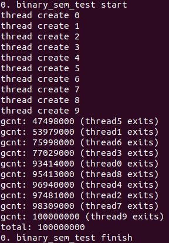
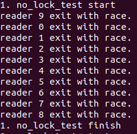
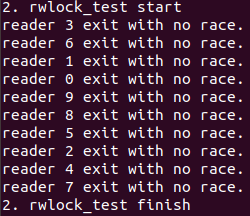

# Semaphore & Readers-Writer Lock
**Semaphore**  
A semaphore is an object with an integer value that can be manipulated by concurrently running threads for multiple purposes. It can be used as a lock to provide mutual exclusion in critical sections, or to synchronize the execution order of threads. The initial value of the semaphore dictates its behavior. For example, if the initial value is 1, only one thread can enter a critical section at a time.

**Readers-Writer Lock**  
This is a special type of locks that allows mulitple readers to acquire a lock to a critical section at the same time, while only one writer can hold a thread at a time.

# POSIX Semaphore
**sem_t**  
Structure containing the integer value used for synchronization.

**int sem_init(sem_t\* s, int pshared, int value)**  
This routine initializes the semaphore with the value passed in the third argument. The second argument is used to indicate whether the thread is shared within threads in a same process or among different processes. 

**int sem_wait(sem_t\* s)**  
- Decrements the semaphore value by one.
- If the value of s is negative, the thread is put to sleep until a subsequent thread calls sem_post.
- Otherwise, return immediately.

**int sem_post(sem_t\* s)**  
- Increments the semaphore value by one.
- If there are one or more threads waiting for this semaphore, wake one of them up.
- A negative semaphore value reflects the number of waiting threads. 

*Within sem_wait() and sem_post(), locks and condition variables are used to prevent race conditions.*

# POSIX Readers-Writer Lock
**pthread_rwlock_t**  
- sem_t lock: Binary semaphore used to protect critical sections within the rwlock code such as reading/updating the 'readers' integer value.
- sem_t writelock: Used to allow only one thread to write to a shared data structure.
- int readers: The number of readers reading in the critical section. 

**int pthread_rwlock_init(pthread_rwlock_t\* lock, const pthread_rwlockattr_t\* attr)**  
- Set the readers count in lock to 0.
- Initializes the lock semaphore to 1 (in order to make it behave as a lock for mutual exclusion)
- Initializes the writelock semaphore to 1 (allowing only one thread to write in a critical section at a time)
- Returns 0 when successful.

**int pthread_rwlock_rdlock(pthread_rwlock_t\* lock)**  
- Acquires the lock with sem_wait.
- Increment the readers count.
- If this is the first reader, also acquire the writelock with sem_wait.
- Release the lock with sem_post.
- By making the first reader acquire a writelock, we can ensure that a reader starts reading only after a write has finished. Also, more readers will be allowed to enter the critical section, but a writer will have to wait until all the readers have completed and the last reader calls sem_post on the write lock.

**int pthread_rwlock_wrlock(pthread_rwlock_t\* lock)**  
- Acquire the write lock with sem_wait(&writelock).

**int pthread_rwlock_unlock(pthread_rwlock_t\* lock)**  
- If this function is called to release a read lock...
  - Decrement the readers count. 
  - If there are more readers in the critical section, do nothing. 
  - If this is the last reader, release the writelock.
- If this function is called to release a write lock.
  - Release the write lock with sem_post(&writelock).

# Implementing Basic Semaphores
**xem_t**  
```
typedef struct __my_sem_t{
  int value;
  int chan;
  struct spinlock lock;
}xem_t
```

**int xem_init(xem_t\* semaphore)**  
```
semaphore->value = 1;
semaphore->chan = 0;
initlock(&semaphore->lock, "semaphore");
```

**int xem_wait(xem_t\* semaphore)**  
```
acquire(&sempahore->lock);
while(semaphore->value <= 0)
  sleep(&semaphore->chan, &semaphore->lock);
semaphore->value--;
release(&semaphore->lock);
```

**int xem_post(xem_t\* semaphore)**  
```
acquire(&sempahore->lock);
semaphore->value++;
wakeup(&semaphore->chan);
release(&semaphore->lock);
```

# Implementing Readers-Writer Lock using Semaphores
**rwlock_t**  
```
typedef __my_rwlock_t{
  xem_t lock;
  xem_t writelock;
  int readers;
}rwlock_t
```

**int rwlock_init(rwlock_t\* rwlock)**  
```
rwlock->readers = 0;
xem_init(&rwlock->lock);
xem_init(&rwlock->writelock);
```  

**int rwlock_acquire_readlock(rwlock_t\* rwlock)**  
```
xem_wait(&rwlock->lock);
rwlock->readers++;
if(rwlock->readers == 1)
  xem_wait(&rwlock->writelock);
xem_post(&rwlock->lock);
```

**int rwlock_acquire_writelock(rwlock_t\* rwlock)**  
```
xem_wait(&rwlock->writelock);
```

**int rwlock_release_readlock(rwlock_t\* rwlock)**  
```
xem_wait(&rwlock->lock);
rwlock->readers--;
if(rwlock->readers == 0)
  xem_post(&rwlock->writelock);
xem_post(&rwlock->lock);
```

**int rwlock_release_writelock(rwlock_t\* rwlock)**  
```
xem_post(&rwlock->writelock);
```

# Test Result ([test_rwlock.c](https://github.com/ektmf7890/xv6-kernel/blob/master/xv6-public/test_rwlock.c)
### Binary Semaphore Correctness Test
- Increments a global counter.
- 10 threads concurrently access the global counter, incrementing it 10,000,000 times. Therefore, the final counter value must be 100,000,000 if the binary semaphore successes to protect the critical section.

  

### Readers-Writer Lock Correctness Test
- Declare shared variable **volatile int buff[10000]**. (volatile: to make sure the code always performs memory access)
- Writers (#of writer therads = 3)
  - Iterate 10,000 times.
  - At even number iterations -> buff[ j ] = j
  - At odd number iterations -> buff[ j ] = j + 1
  - Writers update the buff[10000] array atomically using rwlock. Therefore, whenever a reader reads from the buffer and calculates the sum of the buffer elements, the sum value should either be....
    - 0 + 1 + 2 + ... + 9999 = 49,995,000  (defined as SUM1)
    - 1 + 2 + 3 + ... + 10000 = 50,005,000 (defined as SUM2)

- Readers (#of reader threads = 10)
  - As explained above, if the rwlock behaves correctly, the reader threads should calculate sum values of SUM1, or SUM2. If they get any other sum value, this means the read write lock is not protecting the critical section correctly (in other words, a race condition occurs). Therefore, if we detect any abnormal sum value, we stop the reader thread and print out that a race occured.

- When not using any locks.  

  

- When using Readers-Writer lock for the same workload.  

    

